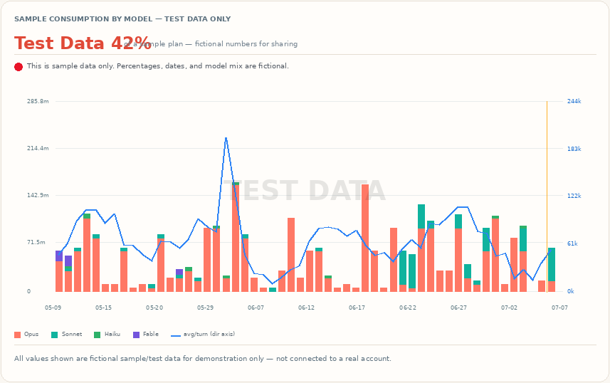
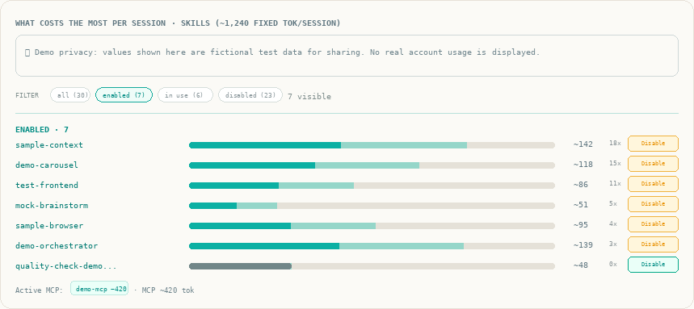

# context-economy

> A Claude Code skill that cuts token and context spend on large or long-running projects. It keeps the
> project's durable truth in lean docs instead of the chat, trims the static overhead of installed skills
> and MCP servers that pads every session, and helps you make smarter model choices. All tooling runs
> locally — zero AI tokens spent.

## What it does

- **Audits your project** — builds or tightens a boot-loader `CLAUDE.md` plus a handoff doc so the next
  session costs less to resume.
- **Measures where your tokens actually go** — history vs. real work, per-session skill/MCP overhead,
  and a breakdown of what's inside your conversations (images, PDFs, file reads, web fetches, subagents).
- **Dashboard** — a local chart showing daily spend stacked by model (Opus / Sonnet / Haiku), an
  efficiency overlay (avg tokens per turn), and a one-line model decision (e.g. "Opus 96% of spend —
  shift routine prompts to Sonnet"). Auto-detects your plan (Pro / Max 5× / Max 20×).
- **Skill & MCP on/off** — ranked list of installed skills and MCP servers by static per-session cost;
  toggle them on/off from the dashboard or CLI without touching settings by hand.
- **Model-advisor nudge (opt-in)** — a zero-cost local hook that detects high-judgment prompts
  (architecture, debugging, planning) and suggests `/model opus` before you send. Runs as regex in
  Node.js — no AI tokens consumed in detection.
- **Honest framing** — the dashboard shows your own logs; the official plan % lives in
  **claude.ai → Settings → Usage**.

## Use it in chat

Say `/context-economy` (or "run context economy on this project", "how do I cut token spend here"). The
skill audits the project, builds or tightens the `CLAUDE.md` + handoff, shows where your tokens go, and
tells you when to `/clear`.

## Install (once per machine)

1. Copy the `context-economy` folder into `~/.claude/skills/`.
2. Install the hooks:
   ```bash
   node ~/.claude/skills/context-economy/scripts/install.cjs
   ```
   On Windows: `node "C:\Users\<you>\.claude\skills\context-economy\scripts\install.cjs"`
3. Restart Claude Code.

This wires two `SessionStart` hooks: a usage breakdown on `/clear`, and a `📦 …tok/session` overhead
line on each start.

**Optional — model-advisor nudge:**
```bash
node ~/.claude/skills/context-economy/scripts/install.cjs --model-advisor   # enable
# CE_MODEL_ADVISOR=off  to silence for one session
# install.cjs --no-model-advisor  to remove
```

## Dashboard

**Windows:** double-click **`dashboard.cmd`** in the skill folder. It starts the local server and opens
your browser automatically at `http://127.0.0.1:3847`. Keep the window open while you use the dashboard.

```bash
--UNIX
node ~/.claude/skills/context-economy/scripts/dashboard-serve.cjs
# then open http://127.0.0.1:3847/

--WINDOWS
node "$HOME\.claude\skills\context-economy\scripts\dashboard-serve.cjs"
# then open http://127.0.0.1:3847/
```

The dashboard shows:
- **Cost/day stacked by model** — see how much of your weekly cap is Opus vs Sonnet vs Haiku
- **Avg tokens/turn overlay** — efficiency dimension the bar chart doesn't already show
- **Model decision headline** — "Opus N% of spend — the bottleneck" (in coral when ≥ 40%)
- **Skill bloat table** — per-session static overhead of each installed skill and MCP, with Enable/Disable
  buttons (moves the folder to `~/.claude/skills.disabled/`; restart Claude Code after toggling)
- **Detected plan badge** — Pro / Max 5× / Max 20× (read from local credentials, never sent anywhere)




> Opening `index.html` directly as a `file://` page disables the Enable/Disable buttons — use the server.

Terminal-only report: `node scripts/dashboard.cjs --report`  
CLI toggle: `node scripts/toggle-skill.cjs off <skill-folder>`  
Paste-ready disable commands: `node scripts/list-bloat.cjs --off`

## Model choice — the biggest lever

Opus typically accounts for 90–97% of billed tokens. The plan's weekly cap is almost always Opus. The
cheapest habit change:

- Set Sonnet as default: add `"model": "claude-sonnet-4-6"` to `~/.claude/settings.json`.
- Escalate per session with `/model opus` only for high-judgment work.
- Use the model-advisor hook to get a nudge before you forget.

## The discipline (what actually saves tokens)

One session, one task: update the handoff, commit, then `/clear`. Switching topics? `/clear` first. For
heavy reads, delegate to a subagent. Turn off skills and MCP you don't use. The skill sets up the
terrain; the saving comes from the habit.

## What it touches on your machine (transparency)

- **Reads:** `~/.claude/projects/**/*.jsonl` (your session logs), `~/.claude.json` (skill/MCP list),
  `~/.claude/.credentials.json` (plan tier only — never the OAuth tokens).
- **Writes:** `dashboard/data.js` (your usage data, local only — ships as an empty placeholder in this
  repo and is regenerated by the server each run), and optionally a `CLAUDE.md` / handoff in your project.
- **Edits:** `~/.claude/settings.json` to add/remove hooks. Run `install.cjs --dry-run` to preview.
- **Sends nothing.** No network calls, no telemetry. Everything stays on your machine.

## Scripts

| Script | Purpose |
|---|---|
| `install.cjs` | Installs SessionStart hooks; `--model-advisor` adds the prompt nudge |
| `dashboard-serve.cjs` | Local server + skill toggle API at `http://127.0.0.1:3847/` |
| `dashboard.cmd` | Windows double-click launcher (starts server + opens browser) |
| `dashboard.cjs` | Generates `dashboard/data.js` from your logs |
| `usage.cjs` | History-vs-work breakdown (runs on `/clear`) |
| `list-bloat.cjs` | Ranks installed skills/MCP by static per-session token cost |
| `context-profile.cjs` | Breaks down what's inside your conversations (images, PDFs, etc.) |
| `toggle-skill.cjs` | CLI on/off for skills |
| `model-advisor.cjs` | UserPromptSubmit hook — detects high-judgment prompts, suggests Opus |
| `precheck.cjs` | Safety check before writing to a project |

## Notes

- Tested on Windows. Scripts are plain Node (`.cjs`) with no dependencies — should work on macOS and
  Linux too, but that's untested.
- `npm test` runs the built-in Node test runner (no extra packages needed).
- Per-skill token costs are estimates (chars ÷ 4) — good for ranking, not exact billing.

## License

MIT. Yours to use, fork, and share.
